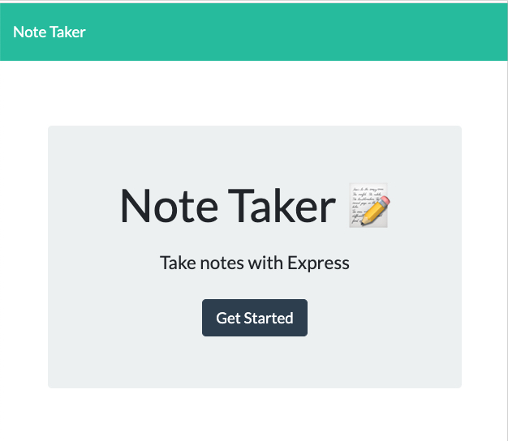
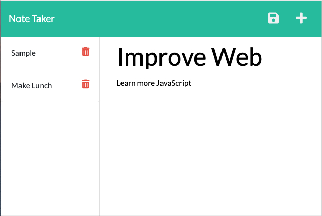

# Note Taker

  

  ## Description
  
  A busy professional needs the ability to record notes and bits of information for use at a later time.  This app allows a user to create multiple notes, save them for future review, and delete when done.
  
  ## Author
  
  The author for this project is [Mike Johnson](https://github.com/mikewebprint)
  
  ## Table of Contents
  
  - [Installation](#installation)
  - [Usage](#usage)
  - [Credits](#credits)
  - [License](#license)
  - [How to Contribute](#contributions)
  - [Tests](#tests)
  
  ## Installation
  
  After the project files are cloned locally, an NPM install of the dependencies is required for the application to run, either by initializing the app locally (npm run dev) or by deploying to another location such as Heroku, etc.
  
  ## Usage
  
  I have this application deployed on Heroku and it can be used here: [https://limitless-sands-96595.herokuapp.com/](https://limitless-sands-96595.herokuapp.com/) Considering that this app has no user authentication, it is only at this moment practical for demo purposes.  One user's notes and deletions will over write another's.  Other developers are free to build on this application for themselves to add more features, such as adding authentication, ranking notes, selecting some as favorites, or archiving notes to be viewed even after deletion.

  

  

  ## Credits
  
  In addition to starter code in this project, I did also pull some code from similar API projects used in class examples. I also followed along with tutorials on YT by Traversy Media and Web Dev Simplified for further understanding of setting up an Express back end, so some of my code structure may mimic those sources as well.
  
  ## License
  
  MIT
  
  ## Features
  
  This project is created in Node.js, using Express.js to build the server and routes that host the app and the API that makes it function.  It is hosted using a delploymnent to Heroku through the command line.
  
  ## Contributions
  
  Contributions to the project can be offered at the repository here: [https://github.com/mikewebprint/note-taker-app](https://github.com/mikewebprint/note-taker-app)
  
  ## Tests
  
  I used Insomnia to test the API connections and routes for GET, POST and DELETE methods.  Data was added and retrieved as expected.

